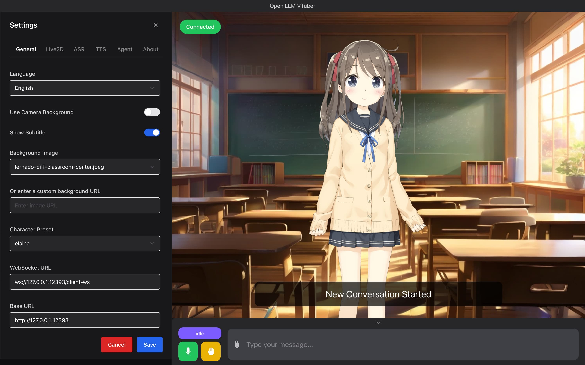
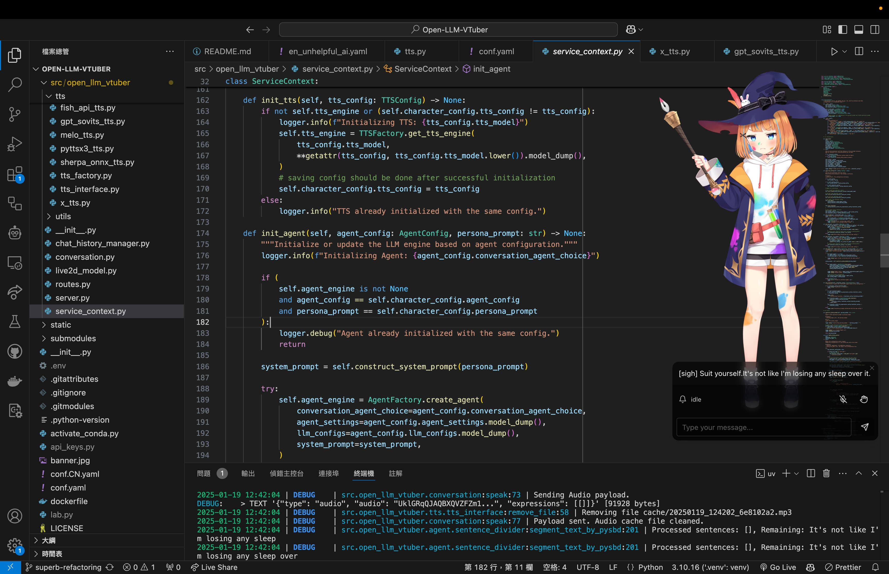

<h1 align="center">Open-LLM-VTuber</h1>
<h3 align="center">

English README

[Documentation](https://open-llm-vtuber.github.io/docs/quick-start)
### 👀 Demo
|  |  |
|:---:|:---:|
|  |  |

## ✨ Features & Highlights
- This for work with shapes.inc!
- 🖥️ **Cross-platform support**: Perfect compatibility with macOS, Linux, and Windows. We support NVIDIA and non-NVIDIA GPUs, with options to run on CPU or use cloud APIs for resource-intensive tasks. Some components support GPU acceleration on macOS.

- 🔒 **Offline mode support**: Run completely offline using local models - no internet required. Your conversations stay on your device, ensuring privacy and security.

- 💻 **Attractive and powerful web and desktop clients**: Offers both web version and desktop client usage modes, supporting rich interactive features and personalization settings. The desktop client can switch freely between window mode and desktop pet mode, allowing the AI companion to be by your side at all times.

- 🎯 **Advanced interaction features**:
  - 👁️ Visual perception, supporting camera, screen recording and screenshots, allowing your AI companion to see you and your screen
  - 🎤 Voice interruption without headphones (AI won't hear its own voice)
  - 🫱 Touch feedback, interact with your AI companion through clicks or drags
  - 😊 Live2D expressions, set emotion mapping to control model expressions from the backend
  - 🐱 Pet mode, supporting transparent background, global top-most, and mouse click-through - drag your AI companion anywhere on the screen
  - 💭 Display AI's inner thoughts, allowing you to see AI's expressions, thoughts and actions without them being spoken
  - 🗣️ AI proactive speaking feature
  - 💾 Chat log persistence, switch to previous conversations anytime
  - 🌍 TTS translation support (e.g., chat in Chinese while AI uses Japanese voice)

- 🧠 **Extensive model support**:
  - 🤖 Large Language Models (LLM): Ollama, OpenAI (and any OpenAI-compatible API), Gemini, Claude, Mistral, DeepSeek, Zhipu AI, GGUF, LM Studio, vLLM, etc.
  - 🎙️ Automatic Speech Recognition (ASR): sherpa-onnx, FunASR, Faster-Whisper, Whisper.cpp, Whisper, Groq Whisper, Azure ASR, etc.
  - 🔊 Text-to-Speech (TTS): sherpa-onnx, pyttsx3, MeloTTS, Coqui-TTS, GPTSoVITS, Bark, CosyVoice, Edge TTS, Fish Audio, Azure TTS, etc.

- 🔧 **Highly customizable**:
  - ⚙️ **Simple module configuration**: Switch various functional modules through simple configuration file modifications, without delving into the code
  - 🎨 **Character customization**: Import custom Live2D models to give your AI companion a unique appearance. Shape your AI companion's persona by modifying the Prompt. Perform voice cloning to give your AI companion the voice you desire
  - 🧩 **Flexible Agent implementation**: Inherit and implement the Agent interface to integrate any Agent architecture, such as HumeAI EVI, OpenAI Her, Mem0, etc.
  - 🔌 **Good extensibility**: Modular design allows you to easily add your own LLM, ASR, TTS, and other module implementations, extending new features at any time

## 👥 User Reviews
> Thanks to the developer for open-sourcing and sharing the girlfriend for everyone to use
> 
> This girlfriend has been used over 100,000 times

## 🚀 Quick Start

Please refer to the [Quick Start](https://open-llm-vtuber.github.io/docs/quick-start) section in our documentation for installation.

# 🎉🎉🎉 Related Projects

Open-LLM-VTuber (https://github.com/Open-LLM-VTuber/Open-LLM-VTuber)
If you like this project buy them a coffee

Their Discord:

## 📜 Third-Party Licenses

### Live2D Sample Models Notice

This project includes Live2D sample models provided by Live2D Inc. These assets are licensed separately under the Live2D Free Material License Agreement and the Terms of Use for Live2D Cubism Sample Data. They are not covered by the MIT license of this project.

This content uses sample data owned and copyrighted by Live2D Inc. The sample data are utilized in accordance with the terms and conditions set by Live2D Inc. (See [Live2D Free Material License Agreement](https://www.live2d.jp/en/terms/live2d-free-material-license-agreement/) and [Terms of Use](https://www.live2d.com/eula/live2d-sample-model-terms_en.html)).

Note: For commercial use, especially by medium or large-scale enterprises, the use of these Live2D sample models may be subject to additional licensing requirements. If you plan to use this project commercially, please ensure that you have the appropriate permissions from Live2D Inc., or use versions of the project without these models.

